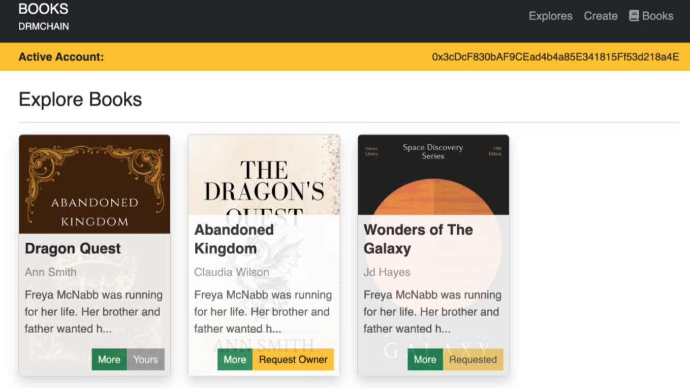
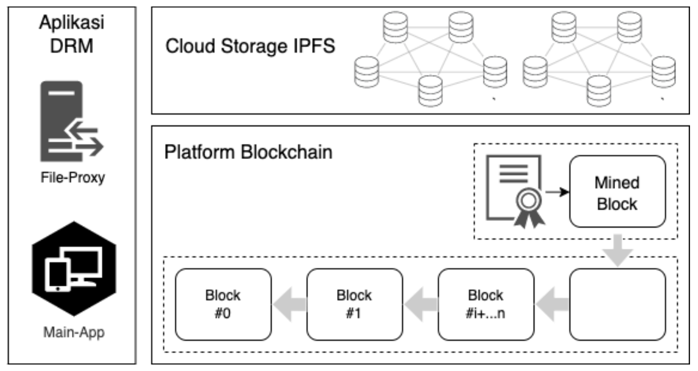
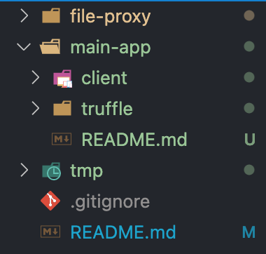

# DRMChain DApp

<!-- INFORMASI -->

DRMChain DApp adalah contoh aplikasi yang mengimplementasi sistem Perlindungan Hak Cipta Buku Digital (PDF) berbasis blockchain secara sederhana.
<br>

## Fitur

- Katalog Buku
- Memposting Buku
- Detail Informasi Buku
- Detail Infromasi Permintaan dan Penerimaan Buku
- Permintaan Hak Kepemilikan Buku
- Penerimaan Hak Kepemilikian Buku
- Membaca Buku dengan PDF Viewer

<br/>



<!-- <p align="right">(<a href="#readme-top">back to top</a>)</p> -->
<br>

<!-- TABLE OF CONTENTS -->

## Daftar Isi

<ul>
    <li><a href="#fitur">Fitur</a></li>
    <li><a href="#arsitektur">Arsitektur</a></li>
    <li><a href="#kebutuhan-sistem">Kebutuhan Sistem</a></li>
    <li><a href="#prasyarat">Prasyarat</a></li>
    <li><a href="#instalasi-dan-menjalankan-aplikasi">Instalasi dan Menjalankan Aplikasi</a></li>
    <li><a href="#cara-menggunakan">Cara Menggunakan</a></li>
     <li><a href="#kontak">Kontak</a></li>
      <li><a href="#lisensi">Lisensi</a></li>
</ul>

</br>

<!-- ARCHITECTURE -->

## Arsitektur

Sistem ini terdiri dari dua buah aplikasi, yaitu: Main-App dan File-Proxy. Aplikasi Main-App adalah aplikasi utama yang digunakan untuk berkomunikasi dengan pengguna, melakukan enkripsi/dekripsi, berkomunikasi dengan aplikasi File-Proxy, serta berkomunikasi dengan Smart Contract. Sedangkan Aplikasi File-Proxy adalah aplikasi secara spesifik menangani proses watermark pada file dan berkomunikasi dengan cloud server IPFS.

<br/>



<br/>

<!-- requirement -->

## Kebutuhan Sistem

- Main-App
  - Truffle v5.6.2 (core: 5.6.2)
  - Ganache v7.4.4 (GUI)
  - Solidity v0.5.16 (solc-js)
  - Node v18.12.1
  - Npm v8.19.2 / yarn v1.22.19
  - Web3.js v1.7.4
  - Metamask Extension (Google Chrome)
- File-Proxy
  - Python v3.10.6
  - pip v22.2.2
  - Flask v2.2.2
  - virtualenv v20.17.1
  - Infura IPFS

<br/>

<!-- <p align="right">(<a href="#readme-top">back to top</a>)</p> -->

## Getting Started

## Prasyarat (OSX)

1.  Instal node js [download](https://nodejs.org/en/download/)
2.  install ganache gui [Download](https://trufflesuite.com/ganache)
3.  Setelah node js terinstall, install beberapa dependensi lain dengan menjalankan perintah berikut pada terminal:

    ```sh
    # periksa versi node
    node --version

    # install NPM
    npm install npm@8.19.2 -g

    # install Yarn
    npm install --global yarn

    # install truffle
    npm install -g truffle

    # periksa versi truffle
    truffle --version
    ```

4.  Install Python3 [download](https://www.python.org/downloads/), atau dapat menggunakan brew (OSX) [instruksi](https://docs.python-guide.org/starting/install3/osx/)
5.  Setelah python3 terinstall, periksa versi python dan pip dengan menjalankan perintah berikut pada terminal:

    ```sh
    # periksa versi python
    python3 --version

    # periksa versi pip
    pip3 --version

    # install venv
    pip3 install virtualenv
    ```

6.  Clone Projek
7.  Struktur direktori apilkasi

    

<br/>

## Instalasi dan Menjalankan Aplikasi

Setelah semua dependensi terinstall, langkah selanjutnya adalah menginstall dan menjalankan kedua aplikasi tersebut. Kita akan secara berurutan menjalankan aplikasi File-Proxy terlebih dahulu sebelum aplikasi Main-App dijalankan. Hal tersebut karena aplikasi File-Proxy akan menjadi service yang digunakan oleh aplikasi Main-App. Tahanpannya sebagai berikut:

1. Jalankan aplikasi Ganache
2. Masuk ke direktori `file-proxy`
3. Sesuaikan konfigurasi file .env _(lebih jelasnya lihat tahapan manual)_
4. Jalankan file `start.sh`
   ```sh
   cd file-proxy
   ./start.sh
   ```
5. Selanjutnya buka terminal baru kemudian masuk ke direktori `main-app`
6. Sesuaikan konfigurasi file .env di dalam direktori truffle dan client _(lebih jelasnya lihat tahapan manual)_
7. Jalankan file `start.sh`
   ```sh
   cd main-app
   ./start.sh
   ```

<br/>
Atau anda dapat menjalankan kedua aplikasi tersebut secara manual dengan mengikuti instruksi berikut:

<br/>

### # **Aplikasi File-Proxy (Flask)**

1. buka terminal baru, masuk ke direktori file-proxy.
2. install library

   ```sh
   # menggunakan virtual env (optional)
   python3 -m venv venv
   source venv/bin/activate

   # install library
   pip install -r requirements.txt
   ```

3. Setup konfigurasi file `.env` dengan akun infura. bagian ini anda diharuskan membuat akun infura ([disini](https://app.infura.io/)) dan membuat KEY IPFS baru dengan menekan tombol `CREATE NEW KEY` dan memilih Network `IPFS`. Perlu diketahui, meskipun membuat KEY IPFS `"GRATIS"`, akan tapi anda diwajibkan mengisi data `kartu kredit` anda. Info lebih lanjut [Infura](https://www.infura.io/pricing).

   Apabila anda berhasil membuat KEY IFPS, anda akan mendapatkan `PROJECT_ID` dan `API KEY SECRET`. silakan masukkan kedua variabel tersebut ke env variabel dalam projek.

   ```sh
   # .env file
   APP_HOST = 0.0.0.0
   APP_PORT = 8700
   APP_DEBUG = True
   IPFS_ID = "xxxxxxx"
   IPFS_SECRET = "xxxxxxxx"
   IPFS_ENDPOINT = "https://ipfs.infura.io:5001"
   ```

4. jalankan file `run.sh`
   ```sh
   ./run.sh
   ```
5. Sampai disini apabila tidak ada kendala, berarti aplikasi File-Proxy sudah jalan. Anda dapat memeriksanya pada browser dengan memasukkan alamat `http://127.0.0.1:8700`.

<br/>

### # **Aplikasi Main-App (Reactjs)**

Terdiri dari dua direktori, yaitu `client` dan `truffle`. Direktori `client` adalah aplikasi utama yang berisi fungsi dan UI (reactjs). Sedangkan direktori `truffle` digunakan untuk menulis kode kontrak (solidity) dan deployment ke jaringan ethereum. Berikut tahapan menjalankan aplikasi main-app:

1. Jalankan aplikasi `Ganache` lalu tekan tombol `quick start`. Dengan cara ini, data akan ter-reset apabila aplikasi `Ganache` di restart. Sebaliknya apabila tidak ingin data ter-reset, dapat memilih tombol `new workspace` [instruksi](https://trufflesuite.com/docs/ganache/how-to/workspaces/create-workspaces/).
2. Buka terminal kemudian masuk ke direktori `application > truffle`.

3. Install library

   ```sh
   # menggunakan npm
   npm install

   # menggunakan yarn
   yarn install
   ```

4. sebelum melakukan deploy, sesuaikan dulu variabel konfigurasi pada file `.env`

   ```env
   GANACHE_HOST = 127.0.0.1
   GANACHE_PORT = 7545
   GANACHE_NETWORK_ID = *
   ```

5. Deploy Kotrak

   ```sh
   # deploy kontrak pada jaringan development
   truffle migrate --network development
   ```

   Response ketika proses compile berhasil dilakukan

   ```sh
   > Network name:    'development'
   > Network id:      1337
   > Block gas limit: 6721975 (0x6691b7)

   1_deploy_book_factor.js
   =======================

   Replacing 'BookFactory'
   -----------------------
   > transaction hash:    0x11c47467a77c7a7f6a943e8d6af7a6a40ecbce03e6713cb406cf5066b1424eb5
   > Blocks: 0            Seconds: 0
   > contract address:    0xE851B4b5D81d4b1B69A26796D6C0eDdB67C5Cd78
   > block number:        31
   > block timestamp:     1675415737
   > account:             0x7cd48a55d8918B9B29886dFc6095b7238e2D2F4B
   > balance:             98.80112398
   > gas used:            2961314 (0x2d2fa2)
   > gas price:           20 gwei
   > value sent:          0 ETH
   > total cost:          0.05922628 ETH

   > Saving artifacts
   -------------------------------------
   > Total cost:          0.05922628 ETH

   Summary
   =======
   > Total deployments:   1
   > Final cost:          0.05922628 ETH
   ```

6. Masuk ke direktori `application > client`.
7. Install library

   ```sh
   # menggunakan npm
   npm install

   # menggunakan yarn
   yarn install
   ```

8. setup konfigurasi react pada file .env

   ```sh
   REACT_APP_FILEPROXY_ENDPOINT= http://127.0.0.1:8700

   REACT_APP_ETH_NETWORK = "ganache"
   REACT_APP_ETH_HOST = 127.0.0.1
   REACT_APP_ETH_PORT = 7547
   ```

9. Jalankan aplikasi

   ```sh
   # menggunakan npm
   npm run start

   # menggunakan yarn
   yarn start

   # sh file
   ./run.sh
   ```

   Tampilan jika aplikasi berhasil dijalankan

   ```sh
   Compiled successfully!

   You can now view truffle-client in the browser.

   Local:            http://localhost:3000
   On Your Network:  http://192.168.18.119:3000

   Note that the development build is not optimized.
   To create a production build, use yarn build.

   webpack compiled successfully
   Files successfully emitted, waiting for typecheck results...
   Issues checking in progress...
   No issues found.
   ```

10. Sampai disini aplikasi sudah jalan, selanjutnya buka browser (chrome, recommended) dan masuk ke alamat `http://127.0.0.1:3000`

<br/>

## Cara Menggunakan

1. Masuk ke aplikasi dengan membuka browser dan memasukkan alamat `http://127.0.0.1:3000`
2. Buat jaringan baru pada metamask dan masukkan informasi jaringan ganance
3. Tambahkan dua akun ethereum pada Ganache ke metamask, dengan cara mamasukkan kunci privatnya. Kedua akun tersebut dapat diberi nama `author` dan `customer`
4. jika persiapan tersebut sudah, selanjutnya dapat melakukan transaksi pada aplikasi.

   Lebih jelasnya dapat dilihat pada demo berikut:

   

<br/>

## Kontak

Email: jehan.labs@gmail.com

Project: https://github.com/wzije/drmchain-dapp.git

<br>

## Lisensi

Distributed under the MIT License.
